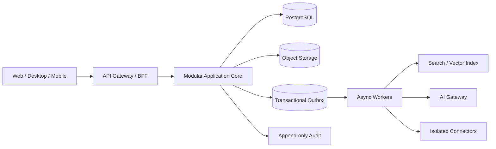

# Архитектура

## Стратегия эволюции

Начальная production-архитектура — **модульный монолит с четкими bounded contexts**, transactional outbox и асинхронными workers. Это снижает операционную стоимость старта, сохраняя путь к выделению сервисов по фактическим bottleneck и ownership boundaries.

## Контексты и правила

- Identity & Tenancy владеет пользователями, memberships, roles и policies.
- Projects владеет проектами, задачами и планированием полевых работ.
- Twin владеет пространственной и технической моделью объекта.
- Documents владеет metadata/version/processing pipeline, но не бизнес-связями других контекстов.
- Assets владеет lifecycle оборудования; размещение связывается через Twin IDs.
- AI не является источником истины и обращается к доменам через те же policy boundaries.
- Integrations не пишут напрямую в доменные таблицы; только commands/events через anti-corruption layer.

## API и события

- External API версионируется и публикует machine-readable contract.
- Команды изменения поддерживают idempotency key и optimistic concurrency (`version`).
- Domain events используют schema version, tenant, correlation и causation IDs.
- Backward compatibility поддерживается минимум один публичный minor lifecycle.
- Long-running операции возвращают job ID и observable state.

## Offline-first sync

Клиент хранит локальную read model и durable outbox. Сервер принимает идемпотентные операции, возвращает authoritative version и изменения после sync cursor. Конфликты разрешаются по типу данных: append для notes/events, merge для независимых полей, explicit review для конфигураций и destructive changes.

## Data ownership

- PostgreSQL — system of record для транзакционных данных.
- Object storage — оригиналы файлов и immutable versions.
- Search/vector stores — производные индексы, полностью перестраиваемые.
- Cache — оптимизация, никогда единственный источник данных.
- Audit — append-only store с retention/legal hold policy.

## Deployment units

1. Web/PWA static assets.
2. API application replicas.
3. Background worker pools по workload class.
4. Managed PostgreSQL с HA/PITR.
5. Object storage с versioning.
6. Observability pipeline.

## Реализованный foundation slice (v0.2)

Локальная среда использует dependency-free Python HTTP service и SQLite в WAL mode. Клиент сохраняет каждое изменение в browser cache до отправки, синхронизирует полное состояние через revision-checked API и продолжает работать при недоступном сервере. Это не финальный multi-user sync protocol, а проверяемый вертикальный срез границ UI → API → durable storage.

Ограничение v0.2: при конфликте ревизий локальный single-user клиент повторяет запись поверх текущей серверной ревизии. До multi-user режима это решение должно быть заменено entity-level versions, tombstones и явной conflict policy.

## Tenant foundation (v0.4)

`Organization` является обязательной границей workspace, idempotency и будущих доменных данных. Клиент передает `X-Organization-ID`; сервер валидирует active tenant до чтения и записи. Legacy singleton workspace мигрирован в `local-dev` без изменения revision или payload. Базовые `users` и `memberships` поддерживают роли Technician, Supervisor, ProjectManager и Administrator; доказательство личности и policy evaluation относятся к FS-016/FS-017.

Tenant ID никогда не принимается из request body для определения области доступа: boundary задается проверенным request context. Тесты создают два tenant и подтверждают отсутствие cross-tenant workspace и idempotency reads.

## Projects vertical slice (v0.6)

`Projects` и `ProjectStages` хранятся как tenant-scoped доменные сущности с составными ключами и внешними ключами, включающими `organization_id`. Внутренний проект `fieldos-platform` агрегирует задачи Development Workspace только на уровне read model: workspace остается контекстом разработки платформы, а клиентские проекты получают собственные стандартные этапы Planning → Survey → Installation → Commissioning → Handover.

Прогресс рассчитывается сервером из статусов задач, поэтому клиенты не могут записать производный процент как отдельную истину. Текущий расчет является портфельной read model; перенос work items в нормализованные таблицы и привязка Buildings относятся к следующему инкременту FS-019.

## Project operations (v0.7)

`Buildings` и `ProjectWorkItems` являются нормализованными сущностями Projects context. Каждый внешний ключ на проект, здание или этап включает `organization_id`; сервер дополнительно проверяет принадлежность связанного объекта выбранному проекту до записи. Work item хранит сроки, исполнителя, оценку и фактическое время, но не смешивается с FS-задачами внутренней разработки.

Portfolio read model объединяет оба потока только для аналитики: прогресс внутреннего `fieldos-platform` рассчитывается из Development Workspace, а клиентских проектов — из `project_work_items`. Следующий инкремент должен добавить optimistic update по `version`, dependency graph и пользовательские команды изменения статусов.

## Productization boundary (v0.8)

Компания-разработчик является design partner и первым tenant, но не зашивается в доменную модель. Различия между компаниями должны выражаться organization settings, policy, feature flags, лицензиями и подключаемыми интеграциями, а не форками приложения. Все пользовательские команды Projects передают явный tenant context и idempotency key; сервер определяет область доступа только по проверенному context, никогда по `organizationId` из body.

Проекты имеют явный `kind`: `internal` используется для разработки платформы, `customer` — для операционных проектов компаний. Buildings и Field Work Items разрешены только для customer projects; этот инвариант проверяется сервером и отражается в UI.

Дальнейшее развертывание должно поддерживать shared SaaS, dedicated tenant и private deployment без изменения доменных контрактов. Billing, entitlements, tenant branding и data residency являются отдельными bounded contexts и не должны проникать в Projects tables.

## Optimistic workflow (v0.9)

Project Work Items изменяются через `expectedVersion`. Update выполняется одной транзакцией: проверка текущей версии, проверка status transition, запись сущности и append-only записи `project_change_log`. Stale client получает `409 version_conflict`, перечитывает authoritative state и не перезаписывает работу другого пользователя.

Переходы статусов задаются серверной state machine. Клиент отображает только допустимые следующие состояния, но сервер остается policy boundary. Завершенные задачи можно переоткрыть в `progress`; прямой переход из backlog в done запрещен.

## Dependency workflow (v0.10)

Зависимости Work Items хранятся как tenant/project-scoped directed graph. Перед добавлением ребра сервер проверяет принадлежность обеих задач проекту, self-reference, duplicate и достижимость зависимой задачи из predecessor; циклические графы отклоняются.

Сохраненный `status` отражает положение задачи в workflow, а производный `effectiveStatus` становится `blocked`, пока хотя бы один predecessor не имеет `done`. Попытка перейти к выполнению, review, testing или done при активных blockers возвращает `409 dependencies_incomplete`. После завершения всех predecessors задача разблокируется автоматически без дополнительной записи состояния.

## Project progress structure (v0.11)

Projects является отдельным route платформы и не смешивается с Development Workspace. Прогресс customer project строится по нескольким независимым измерениям: общий поток, этапы, здания и organization-scoped `WorkType`. Начальный справочник включает Data, Termination, Fiber, Access Control, CCTV, Network, Commissioning и Other; другие компании смогут менять справочник через настройки без изменения схемы.

Project Work Item ссылается на WorkType, Stage и опционально Building. Сервер рассчитывает для каждого вида работ количество задач, completed, blocked и weighted progress. Создание project, building и work item записывается в `project_change_log` в той же транзакции, что и доменная сущность, и показывается в журнале проекта.

Общий `project.progress` считается по evidence-сигналам, а не только по Work Items. В формулу входят Development/Work Item statuses и непустые field progress signals из `daily_progress_entries` и `unit_progress`. Пустые work types не участвуют в denominator и не занижают процент. `taskSummary` намеренно остается счетчиком задач, чтобы не смешивать количество задач с количеством unit отметок или daily updates.

## Technician daily reporting (v0.12)

Структура исходных spreadsheets нормализована как `ProjectLocation → WorkType → WorkTypeAction → DailyProgressEntry`. Она сохраняет Date Updated, Floor/Area, Suite Total, Action, Status, Percent, Quantity и Comments без переноса табличного UX в приложение. Actions конфигурируются по виду работ: например Data содержит Prewire, Terminated & Tested и Trimout; Fiber — Prewire, Terminated & Tested и As Built Sent; Cameras — Prewire, Installed и View Verified.

Project Detail оптимизирован для телефона: техник создает отчет за сегодня в одном диалоге и может одновременно зафиксировать Issue с severity. Daily entry редактируется через optimistic version. Progress по виду работ строится по последнему обновлению каждой комбинации location/action, поэтому повторные дневные записи формируют историю, а не искусственно увеличивают вес этапа.

## Unit-level completion and Jobber draft (v0.13)

Floor с `suiteTotal` получает упорядоченный набор `ProjectUnit`. Готовность хранится отдельно для каждой комбинации Unit, WorkType и Action, поэтому один unit может иметь завершенный Data Prewire, но незавершенные Termination или Access Control. Мобильный location detail позволяет выбрать scope/action и переключать готовность unit одним нажатием; completion date фиксируется сервером.

Daily report generator агрегирует unit completions, обычные daily updates и issues только за выбранную дату и возвращает copy-ready text. Это подготовка данных для Jobber, но не внешняя отправка: connector остается опциональным и потребует отдельной авторизации. Audio Zone использует расширенный профиль: zone type, speaker/display counts, sources и equipment notes.

## Unit progress offline outbox (v0.14)

Unit taps применяются к локальной read model немедленно и записываются в browser durable outbox с постоянным idempotency key. Повторные офлайн-изменения одной комбинации Unit/WorkType/Action объединяются в последнее состояние. При восстановлении сети очередь отправляется последовательно; серверный version conflict не перезаписывает удаленное состояние и требует повторной проверки пользователем.

Authoritative refresh не сбрасывает выбранные WorkType и Action: UI хранит scope отдельно для каждой location и повторно накладывает pending outbox поверх серверной read model.

## Unit bulk updates and local progress log (v0.15)

Карточки Unit имеют фиксированную высоту, а состояние сохранения показывается компактным символом в правом верхнем углу без layout shift. Checkbox `Все` массово отмечает или отменяет текущую комбинацию WorkType/Action; каждое изменение остается отдельной идемпотентной операцией outbox и отдельным audit event.

Location Detail показывает последние изменения своих units из `project_change_log`. Полный воспроизводимый timeline со снимком на выбранную дату и графиком активности запланирован отдельно как FS-055, чтобы аналитическая read model не усложняла критичный technician workflow.

## Immutable project audit chain (v0.16)

Каждое новое событие `project_change_log` связывается с предыдущим событием проекта через SHA-256 hash chain. В hash включены tenant, project, entity, action, old/new values, source, timestamp и hash предыдущего события. Database triggers запрещают UPDATE и DELETE после sealing; существующие события однократно запечатываются при переходе на schema 013.

`GET /api/v1/audit/integrity` пересчитывает цепочку для организации или выбранного проекта и возвращает только результат проверки. Это обнаруживает изменение содержимого или порядка событий, но не заменяет внешний immutable archive и retention policy, которые потребуются перед production.

## Configurable location hierarchy (v0.17)

Project Location поддерживает рекурсивную структуру через `parentLocationId`: Building может содержать Floor, Floor — Suite или Area, Suite — Room, при этом глубина не зашита в схему. Родитель обязан принадлежать тому же tenant и project; database triggers и application validation запрещают cross-project links и циклы.

`customFields` хранит ограниченный JSON-объект до 16 KiB для будущих tenant/project templates. Это расширяемая точка, а не готовый редактор полей: следующим инкрементом должны стать versioned field definitions и мобильные form schemas, чтобы пользователи не работали с raw JSON.

## Opt-in local compute nodes (v0.18)

macOS Compute Agent является отдельным минимальным процессом без доступа к проектным данным. Он отправляет heartbeat и агрегированные CPU, memory, battery, power, thermal и load metrics через защищенный enrollment token. Узел допускается к будущей очереди вычислений только при двойном согласии: agent запущен с `--compute-enabled`, а Administrator включил узел в Admin UI.

Первый режим масштабирования — независимые jobs между узлами с учетом нагрузки, памяти и heartbeat. Распределение одной модели между несколькими Mac является отдельной capability: оно зависит от MLX backend и пропускной способности сети и не должно включаться без benchmark, поскольку network synchronization может быть медленнее одного M1 Pro.

## Editable unit registry (v0.19)

Unit отделен от его progress: карточка остается быстрым переключателем готовности, а отдельное действие открывает редактор identity и notes. Создание и изменение Unit используют tenant/project/location boundary, optimistic version и append-only project audit. `customFields` подготовлен для будущих versioned form templates и ограничен 16 KiB.

## Configurable work workflows (v0.20)

WorkType и его Actions являются organization-scoped configuration, а не frontend enum. Administrator может создавать новый вид работ и версионно изменять название, цвет и этапы. Технические codes остаются стабильными ключами для отчетов и интеграций; существующие Actions не удаляются физически, поэтому исторический progress сохраняет ссылки.

## Versioned custom field schemas (v0.21)

Administrator определяет поля Location и Unit с типами text, number, boolean, date или select. Определение имеет стабильный code, version, required/active flags и варианты списка. Web-клиент строит формы из schema, а backend повторно валидирует значения, поэтому новые характеристики объектов не требуют изменения frontend или database columns.

## Development agent presence (v0.22)

Header показывает явное состояние Codex: working, idle, waiting, blocked или limit. Status heartbeat защищен тем же enrollment token, что и локальный agent. Пользовательская кнопка устанавливает durable `continuationRequested`, но не запускает Codex самостоятельно: реальный запуск требует поддерживаемого API/session integration с хост-приложением.

## Automatic project Daily Log (v0.23)

Daily Log является представлением append-only `project_change_log`, а не отдельным вручную поддерживаемым источником истины. Изменения unit progress, структуры объекта, полевых задач и проблем автоматически преобразуются в понятные человеку записи и объединяются с ручными пояснениями `daily_updates`. Ручные записи остаются редактируемыми и версионными; автоматические записи неизменяемы и наследуют дату события из audit trail.

## GitHub sync settings (v0.25)

Admin panel stores Git synchronization preferences per organization: remote URL, branch, commit strategy, auto commit, auto push and docs inclusion. Credentials are deliberately out of scope for the database and browser UI. Git authentication must use SSH keys, the local Git credential manager or a later encrypted secret store. This keeps repository automation auditable without placing GitHub tokens into SQLite, localStorage or exported workspace files.

Default strategy is `per_task`: commit after a completed task or a tight group of related fixes, not after every experiment. This preserves a defensible development history while avoiding noisy commits.

## Unified Logs and Platform Settings (v0.27)

Logs Explorer is a separate route backed by `GET /api/v1/logs`. It merges append-only `project_change_log` events with Development Workspace audit entries and supports source, project, entity and text filters. This is a user-facing investigation surface; immutable storage remains the project audit chain.

Admin Platform Settings are organization-scoped and persisted in `platform_settings`. The first settings are default language, timezone, role mode, telemetry privacy and log retention. `roleMode=enforced` is only a configuration signal until server-side RBAC is implemented; UI-only role controls are not treated as a security boundary.
